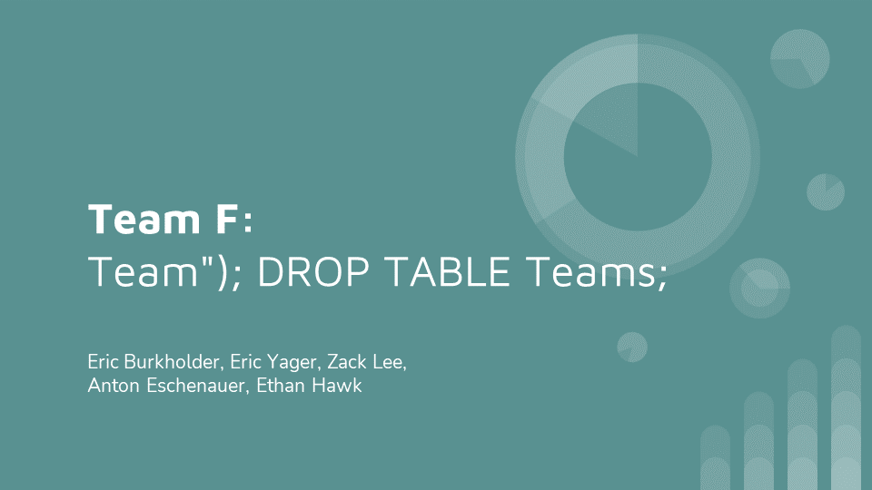
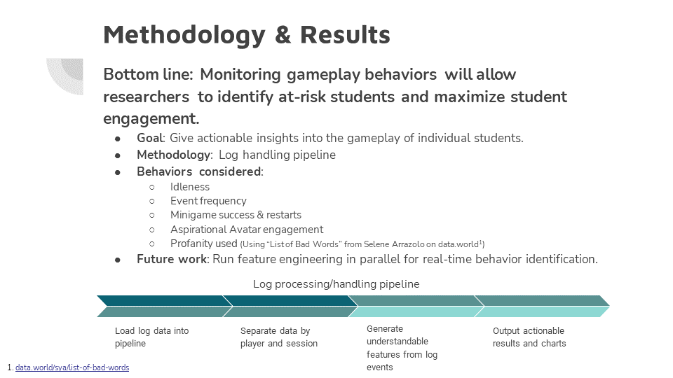
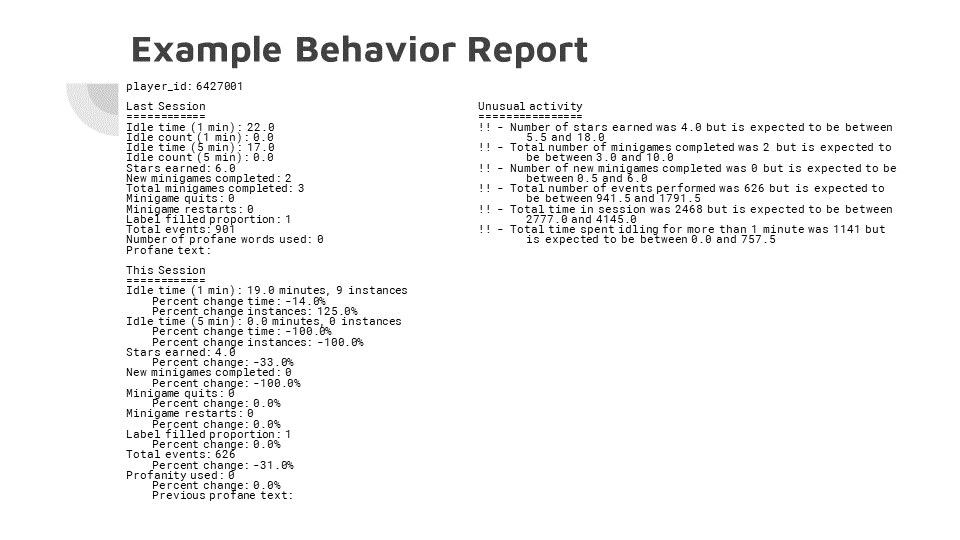
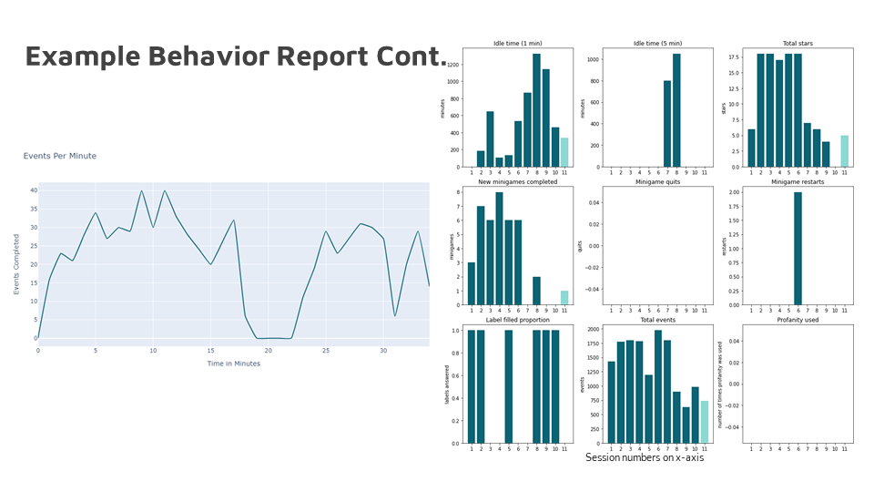

# DataFest 2022

Friday, March 25, to Sunday, March 27, was Purdue's competition for the 2022 DataFest. The task for this year was to analyze log data from a video game. According to the DataFest Documentation, "The overall goal for the designers of the game is to prevent negative health outcomes such as HIV, sexually transmitted infections, and substance misuse in young at-risk teens (ages 11-14 years) by increasing their perception of risk and acquiring healthy skills to prevent engaging in risky behavior."

### Our Team

- [Eric Yager](https://github.com/ejyager00)
- [Zack Lee](https://github.com/zlee1)
- Eric Burkholder
- [Ethan Hawk](https://github.com/ehawkvu)
- Anton Eschenauer

## The Challenge

From the DataFest Documentation:

> The challenge in this DataFest is to help the researchers who created Elm City Stories to see if their game might be useful in understanding real-life behavior.  To do this, they're asking you to try to characterize, measure, observe, and display patterns of play within the game.  One goal for future games is to design them so that the games produce real-time data that is useful to psychology researchers. Your answers will help the Play2Prevent Lab researchers better understand what types of data this might be.

## Our Approach

Our team decided that the best way to help the researchers would be to create a pipeline that would transform the log data into information about gameplay characteristics. We hoped this would allow researchers to characterize the gameplay of individual students. Then, in the future, they could see how these characteristics compare to student outcomes and identify at-risk students. 

## Presentation

